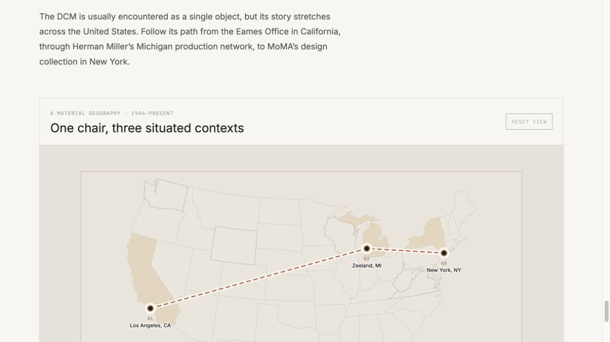

# Assignment 3 · Geospatial Structure

## Website

[View the interactive website](https://nicoleluu.github.io/Assignment-3/#geospatial)

## Mapbox update

## Project connection

A geospatial structure can extend my chair study by tracing the hidden geography behind a familiar object: where wood and steel originate, where parts are fabricated, where labor and assembly take place, how the finished chair is distributed, and which museums collect it. Mapping those relationships would connect material, relational, and temporal structures to real places, making the chair visible as part of a wider production and cultural network rather than as an isolated design object.
